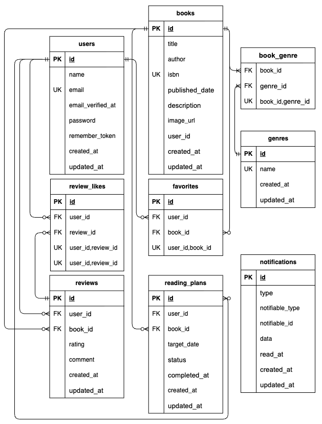

# BookShelf 書籍レビューアプリ

## 概要

書籍の検索・登録・レビュー・お気に入り管理などを行うWebアプリケーションです。

ユーザーは書籍の検索や登録、レビューの投稿、お気に入り登録を行うことができます。

また、読書計画を作成して読書状況を管理したり、期限に応じたリマインダー通知を受け取ったりすることができます。

Google Books APIを利用した書籍検索機能や、Laravel Sanctumを利用した公開APIも実装しています。

---

## 機能一覧

### ユーザー

- ユーザー登録
- ログイン / ログアウト
- メール認証

### 書籍

- 書籍一覧表示
- 書籍検索
- 書籍並び替え
- 書籍登録
- 書籍編集
- 書籍削除
- ISBNによる書籍検索

### ジャンル

- ジャンル一覧表示
- ジャンル登録

### レビュー

- レビュー投稿
- レビュー編集
- レビュー削除
- レビューへのいいね
- いいね解除

### お気に入り

- お気に入り登録
- お気に入り解除
- お気に入り一覧表示

### 読書計画

- 読書計画登録
- 読書計画編集
- 読書計画削除
- 読書計画一覧表示
- 読了処理
- 期限切れ処理
- リマインダー通知

### ランキング・レポート

- 書籍ランキング表示
- 読書レポート表示

### API

- 書籍一覧取得
- 書籍詳細取得
- 書籍登録
- 書籍更新
- 書籍削除

---

## 環境構築

### Dockerビルド

```bash
git clone git@github.com:hana-ka/bookshelf-app.git
cd bookshelf-app
```

### Laravel環境構築

```bash
composer install

cp .env.example .env
```

### .env設定

`.env` のデータベース接続情報を以下のように設定してください。

```env
DB_CONNECTION=mysql
DB_HOST=mysql
DB_PORT=3306
DB_DATABASE=laravel
DB_USERNAME=sail
DB_PASSWORD=password
```

Google Books APIを利用するため、APIキーを設定してください。

```env
GOOGLE_BOOKS_API_KEY=Google Books APIのAPIキー
```

### Sailの起動

```bash
./vendor/bin/sail up -d
```

Sailのエイリアスを設定している場合は、以下のコマンドでも実行できます。

```bash
sail up -d
```

### アプリケーションキーの生成

```bash
sail artisan key:generate
```

### データベースのマイグレーションと初期データ投入

```bash
sail artisan migrate --seed
```

### フロントエンドのセットアップ

```bash
sail npm install
```

開発中はViteを起動してください。

```bash
sail npm run dev
```

### phpMyAdmin

phpMyAdminを利用する場合は、以下のURLにアクセスしてください。

http://localhost:8080

---

## 使用技術（実行環境）

- PHP 8.5
- Laravel 10.x
- MySQL 8.4
- Docker
- Laravel Sail
- Vite
- Tailwind CSS
- @tailwindcss/forms
- Laravel Sanctum
- Laravel Fortify
- Git / GitHub

## 開発環境・ツール

- phpMyAdmin
- VS Code
- Postman

---

## ER図



---

## APIエンドポイント一覧

| メソッド | パス | 概要 |
|---|---|---|
| GET | `/api/v1/books` | 書籍一覧を取得 |
| GET | `/api/v1/books/{book}` | 書籍詳細を取得 |
| POST | `/api/v1/books` | 書籍を登録 |
| PUT | `/api/v1/books/{book}` | 書籍を更新 |
| DELETE | `/api/v1/books/{book}` | 書籍を削除 |

※ POST / PUT / DELETE はLaravel Sanctumによる認証が必要です。

---

## URL

- 開発環境：[http://localhost](http://localhost)
- phpMyAdmin：[http://localhost:8080](http://localhost:8080)

---

## テスト

Featureテスト・Unitテストを実装しています。

### テスト実行

```bash
sail artisan test
```

### カバレッジ確認

```bash
sail artisan test --coverage
```

### コードフォーマットチェック

```bash
sail bin pint --test
```

---

## 補足

- Laravel Fortifyを使用して認証機能を実装しています。
- Laravel Sanctumを使用してAPI認証を実装しています。
- FormRequestを利用したバリデーションを実装しています。
- Policyを利用した認可処理を実装しています。
- Google Books APIを利用した書籍検索機能を実装しています。
- Laravel Notificationを利用したリマインダー通知を実装しています。
- Schedule / Console Commandを利用した読書計画の期限処理を実装しています。
- PHP Enumを利用して読書計画の状態を管理しています。
- Featureテスト・Unitテストを実装しています。

---

## 作成者

長田　華香